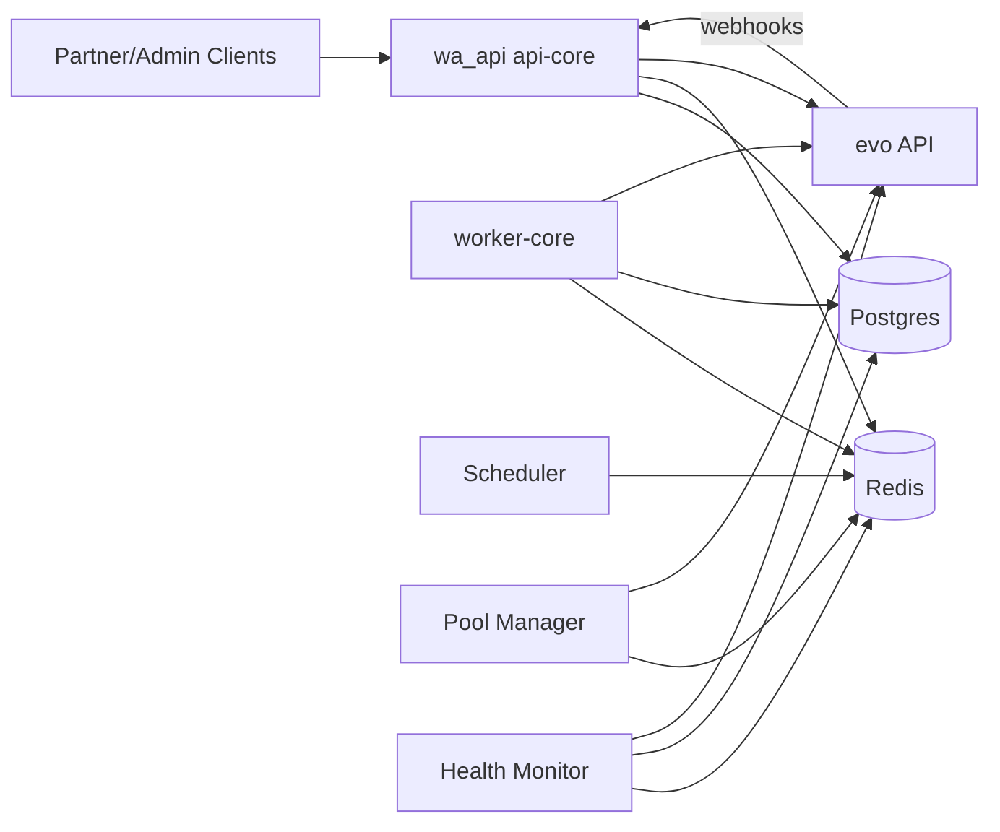
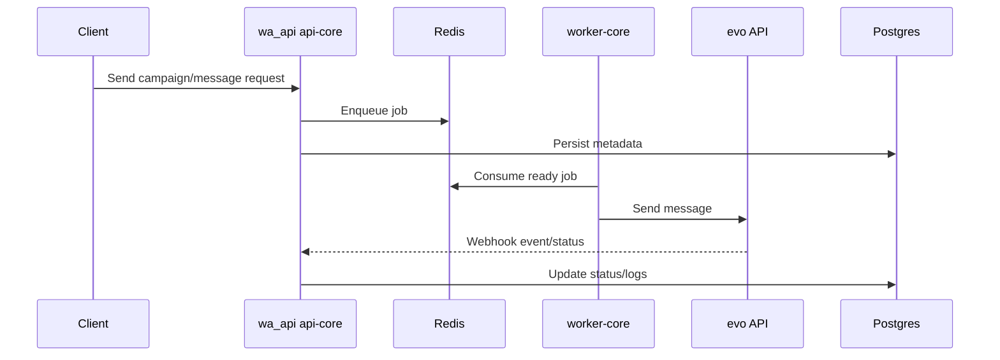
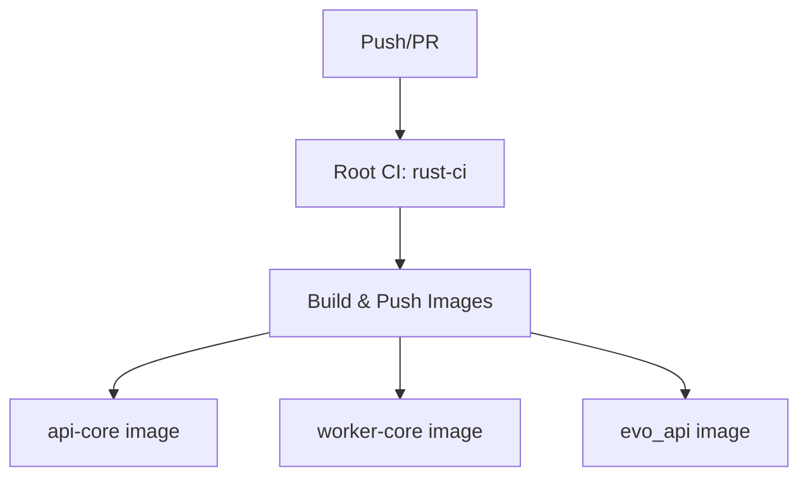

# com Monorepo

This repository contains a messaging platform composed of:

- **`wa_api/`**: Rust services (API gateway + workers) for campaign/message orchestration, queuing, health, and tenant controls.
- **`evo/`**: Evolution API (Node.js/TypeScript) used as the WhatsApp-facing integration layer.
- **Root CI/CD** for linting/testing/building and publishing container images for all core services.

---

## What is this?

This is a multi-service communication backend designed to:

- receive API requests from partner/admin clients,
- enqueue and schedule outbound workloads,
- process jobs safely with worker pools,
- integrate with Evolution API for WhatsApp connectivity,
- receive webhook events back from Evolution API,
- persist and monitor operational state (Postgres + Redis).

---

## High-level architecture



---

## How it works

1. Clients call **`wa_api` API gateway** endpoints.
2. Requests are authenticated and validated.
3. Jobs and state are written to **Redis** and **Postgres**.
4. **Scheduler** promotes due jobs to ready queues.
5. **Worker-core** consumes queues and triggers Evolution API operations.
6. Evolution API emits webhooks back to wa_api for lifecycle/message updates.
7. **Health monitor** and **pool manager** keep instances healthy and available.

### Message lifecycle (simplified)



---

## Repository structure

```text
.
├── .github/workflows/ci-cd.yml         # Root CI/CD for wa_api + evo image publishing
├── wa_api/                             # Rust workspace
│   ├── apps/api-core                   # API + pool manager + health monitor runtime
│   ├── apps/worker-core                # Scheduler + worker runtime
│   ├── crates/api_gateway              # HTTP routes/auth/services
│   ├── crates/worker                   # Job processing + rate controls
│   ├── crates/scheduler                # Scheduled -> ready queue promotion
│   ├── crates/pool_manager             # Instance pool lifecycle and warmup
│   ├── crates/health_monitor           # Health checks, reconciliation, orphan cleanup
│   ├── crates/shared                   # Config, DB/Redis/evo clients, shared types
│   ├── docker-compose.yml              # Full wa_api stack (api-core, worker-core, pg, redis)
│   └── docker-compose.evo.yml          # evo service compose alongside shared network
├── evo/                                # Evolution API (Node.js/TypeScript)
│   ├── src/
│   ├── .env.example
│   └── .github/workflows/              # Evo-specific lint/security/publish workflows
├── env.app.example                     # App integration env template
└── env.evo.example                     # Evo deployment env template
```

---

## Components

### `wa_api` components

- **api-core**: starts API server, pool manager, and health monitor.
- **worker-core**: starts scheduler and worker loops.
- **api_gateway**: routes (`message`, `campaign`, `instance`, `analytics`, `contact`, `admin`, `webhook`) + auth middleware.
- **worker**: queue consumption and dispatch.
- **scheduler**: periodic scheduled-job promotion.
- **pool_manager**: instance availability, warmup progression, health checks.
- **health_monitor**: deep health routines, stale checks, orphan cleanup.
- **shared**: configuration loading and common clients.

### `evo` components

- WhatsApp and integration-facing API layer.
- Runs as independent service, used by wa_api for messaging operations.
- Emits webhook events back to wa_api.

---

## Workflows (CI/CD)

### Root workflow (`.github/workflows/ci-cd.yml`)

**Triggers**
- Push to `main`
- Pull request targeting `main`

**Jobs**
1. **rust-ci**
   - `cargo fmt --all -- --check`
   - `cargo clippy -- -D warnings`
   - `cargo test`
2. **build-and-push** (after rust-ci)
   - Builds and pushes 3 images:
     - `api-core`
     - `worker-core`
     - `evo_api`
   - Publishes to GHCR.

### evo workflows (`evo/.github/workflows/`)

- `check_code_quality.yml`: lint + Prisma client generation + build (main/develop + PRs)
- `security.yml`: CodeQL + dependency review
- `publish_docker_image.yml`: semver tag release image publish
- `publish_docker_image_latest.yml`: publish `latest` on `main`
- `publish_docker_image_homolog.yml`: publish `homolog` on `develop`

### CI flow diagram



---

## Use cases

- Multi-tenant outbound messaging orchestration.
- Campaign/job scheduling with controlled throughput.
- Operational observability and health-driven lifecycle management.
- WhatsApp-backed notification pipelines through Evolution API.
- Scalable worker pools for high-volume async processing.

---

## Setup

### Prerequisites

- Docker + Docker Compose
- (Optional local dev) Rust toolchain + Cargo
- (Optional local dev for evo) Node.js + npm

### 1) Clone and configure envs

Create environment files from templates:

- Use root templates:
  - `env.app.example`
  - `env.evo.example`
- For evo standalone/local:
  - `evo/.env.example`

Create local runtime files (untracked):

```bash
cp env.app.example .env.app
cp env.evo.example env.evo
```

### 2) Configure minimum required values

At minimum for `wa_api` runtime:

- `DATABASE_URL`
- `REDIS_URL`
- `EVO_BASE_URL`
- `EVO_API_KEY` or `EVO_INTERNAL_API_KEY`
- `ADMIN_API_KEY`
- `PAUTH_API_KEY`
- `WEBHOOK_SHARED_SECRET`

Recommended security values:

- `SUPABASE_JWT_SECRET`
- `ADMIN_JWT_SECRET`
- strict `CORS_ALLOWED_ORIGINS` (avoid `*` in production)

---

## How to run

### Option A: Docker (recommended)

From `wa_api/`:

```bash
docker compose up -d
```

This brings up:
- `postgres`
- `redis`
- `api-core`
- `worker-core`

To scale workers:

```bash
docker compose up --scale worker-core=4 -d
```

To run evo service compose:

```bash
docker compose -f docker-compose.evo.yml up -d
```

### Option B: Local process run

#### wa_api

From `wa_api/`:

```bash
cargo run -p api-core
cargo run -p worker-core
```

#### evo

From `evo/`:

```bash
npm ci
npm run db:generate
npm run build
npm run start
```

---

## Environment variables

### wa_api (core)

| Variable | Required | Purpose |
|---|---|---|
| `DATABASE_URL` | Yes | Primary Postgres connection for wa_api data |
| `REDIS_URL` | Yes | Queue/cache backend |
| `EVO_BASE_URL` | Yes | Base URL of Evolution API |
| `EVO_API_KEY` | Yes* | Evo API auth key (fallback behavior exists) |
| `EVO_INTERNAL_API_KEY` | Recommended | Shared internal secret between wa_api and evo |
| `WEBHOOK_SHARED_SECRET` | Recommended | Webhook verification for evo -> wa_api |
| `GATEWAY_PORT`/`PORT`/`SERVER_PORT` | No | API server port (default `8080`) |
| `WORKER_COUNT` | No | Number of worker loops (default `4`) |
| `MIN_SEND_DELAY_SECS` | No | Minimum random delay between sends (default `8`) |
| `MAX_SEND_DELAY_SECS` | No | Maximum random delay between sends (default `15`) |
| `CORS_ALLOWED_ORIGINS` | No | Comma-separated CORS origins |
| `ADMIN_API_KEY` | Recommended | Admin route auth key (legacy path still used) |
| `PAUTH_API_KEY` | Recommended | Partner route auth key (legacy path still used) |
| `SUPABASE_JWT_SECRET` | Recommended | JWT validation secret |
| `ADMIN_JWT_SECRET` | Recommended | Admin JWT validation secret |
| `ALERT_WEBHOOK_URL` | No | Alerts endpoint for operational warnings |
| `PLATFORM_DATABASE_URL` | No | Optional external platform DB for deep orphan sync |
| `WA_API_WEBHOOK_URL` / `PLATFORM_WEBHOOK_URL` | No | Webhook target URL override |
| `PLATFORM_API_KEY` | No | Optional platform integration auth |

\* `EVO_API_KEY` defaults from `EVO_INTERNAL_API_KEY`/`WEBHOOK_SHARED_SECRET` if absent.

### evo

See:
- `evo/.env.example`
- `env.evo.example`

Key groups:
- Server/network (`SERVER_*`, `CORS_*`)
- Database (`DATABASE_*`)
- Auth (`AUTHENTICATION_API_KEY`)
- Webhooks (`WEBHOOK_*`)
- Cache (`CACHE_*`)
- Integrations (RabbitMQ, Kafka, SQS, Socket/Pusher, OpenAI, Typebot, Chatwoot, Dify, S3/MinIO)

---

## Validation commands

### Root CI-equivalent checks

#### wa_api

```bash
cd wa_api
cargo fmt --all -- --check
cargo clippy -- -D warnings
cargo test
```

#### evo

```bash
cd evo
npm ci
npm run lint:check
npm run db:generate
npm run build
```

---

## Troubleshooting

- **evo build/lint failures**: run `npm run lint -- --fix` inside `evo/` and re-run checks.
- **Webhook auth issues**: ensure shared secrets match across `wa_api` and `evo`.
- **Queue not draining**: check `WORKER_COUNT`, Redis connectivity, and worker-core logs.
- **CORS blocked**: verify `CORS_ALLOWED_ORIGINS` is explicitly set for your frontend domains.

---

## Additional project docs

- evo upstream docs: `evo/README.md`
- Root CI workflow: `.github/workflows/ci-cd.yml`
